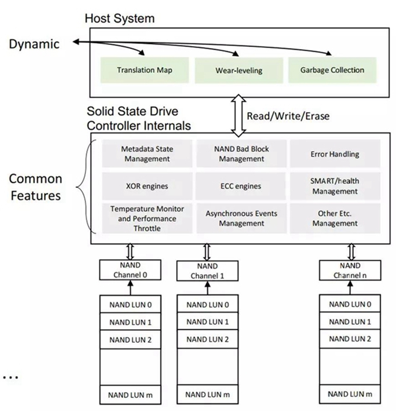
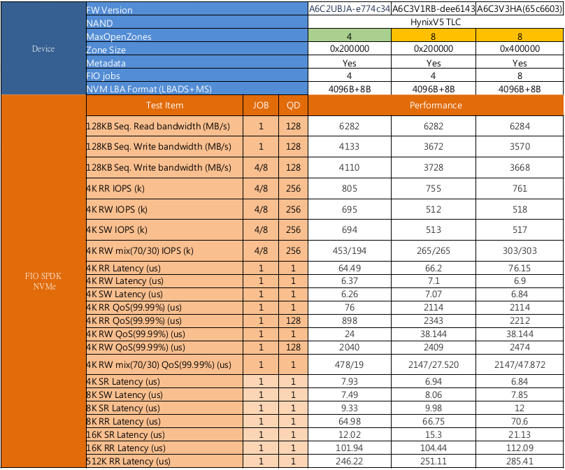

# 通用数据库引擎和Nand Flash的冲突
&ensp;&ensp;&ensp;&ensp;机械硬盘可以对一个块原地修改，但是Nand Flash因为使用寿命和物理特性的限制(块擦写次数寿命，块写前要先擦除)，需要最大限度均衡地写所有块，频繁读写Flash上的同一个块，会快速缩短这个块的寿命。基于这个原因，要求对Nand Flash上的块进行顺序写，即写完一个块后写下一个块。  
&ensp;&ensp;&ensp;&ensp;数据库存在很多频繁更新数据的场景，这些数据很多时候都会位于不同的块上，此时需要把要修改的块的数据拷贝出来，修改后写入一个新的块，并把旧块标记为可回收，这个Copy-WriteBack过程会浪费性能。所以，一种符合闪存物理特性的数据库引擎对提升数据库和闪存性能很重要。

# rocksdb一种专为闪存设计的数据库
&ensp;&ensp;&ensp;&ensp;针对闪存的物理特性，出现了一批新型数据库，知名度和使用最广泛的是rocksdb，从levelDB发展而来的K-V数据库。rocksdb特点是对于wal日志只会append，对于已经落盘的数据文件不会修改，这是针对闪存特性做的设计。  
rocksdb存储结构如下：

&ensp;&ensp;&ensp;&ensp;rocksdb特点是数据先写内存的memtable，当memtable写满后会被锁定变成immutable memtable禁止修改，Flush线程会把immutable memtable刷到盘上。
rocksdb盘上文件是分层的，Level 0, Level 1...Level N, Level 0的文件最新，Level 1的次之，依次类推。  
&ensp;&ensp;&ensp;&ensp;compaction过程：参看上图，上层Level中sst文件数量达到指定数量，会执行压缩功能，把多个sst文件进行去旧压缩合并成新的sst文件并写入到下层Level，这些被合并的sst文件会被删除。  
## rocksdb的性能优化
&ensp;&ensp;&ensp;&ensp;一个memtable大小超过配置的write_buffer_size大小，会被标记为immutable memtable，当所有memtable包括immutable memtable数量达到max_write_buffer_number时，此时rocksdb将会停止写入，直到Flush线程把immu memtable刷到disk后，写入才能继续。因此当通过iostat看到盘有较长空闲时间时，那么增大max_write_buffer_number减少盘的空闲时间，可降低写失速现象。  
&ensp;&ensp;&ensp;&ensp;增加max_background_flushes刷盘线程数量也会提升写入速度。

&ensp;&ensp;&ensp;&ensp;由于每次写操作都会先写wal日志，所以关闭wal对写性能有一定提升，但是会导致宕机后数据丢失的风险，一般wal都会开启。

&ensp;&ensp;&ensp;&ensp;增加compaction线程数量max_background_compactions可提升压缩sst文件速度。

&ensp;&ensp;&ensp;&ensp;写盘速度造成的Backpressure，当nvme命令延迟过大会降低flush和compaction速度，从而会造成停止写memtable。

&ensp;&ensp;&ensp;&ensp;Cpu性能影响，当cpu跑满时，CPU可能是影响读写性能的重要因素。

# OpenChannel SSD的出现和特点
&ensp;&ensp;&ensp;&ensp;Open Channel SSD 实现了把FTL从SSD内部迁移到上层的Host端，迁移的功能有Data Placement, Garbage Collection, L2P table , I/O Scheduling, Weal-leveling 等。  
&ensp;&ensp;&ensp;&ensp;传统SSD 对于上层来说，就是一个黑匣子，现在把FTL的主要功能转移到上层，就是开放了这个黑匣子，相当于把SSD内部直接暴露给了Host端，可能是操作系统，也可能是某个应用程序，这样用户可以跟据自己的需要设计和实现自己的FTL，以达到最佳效果。  
&ensp;&ensp;&ensp;&ensp;Open-Channel被选中，用以控制 QoS 和延迟。 Open-Channel将本来位于NVMe SSD上Firmware中的对Flash管理和控制的部分功能，交给了Host上的应用软件。让应用根据自身的业务特点，对盘上的Flash进行有效的管理，如图1与图2所示。很多情况下，Host上应用的管理，可以避免在垃圾回收等各类对前端应用IO请求的影响。  
&ensp;&ensp;&ensp;&ensp;普通nvme设备架构：

&ensp;&ensp;&ensp;&ensp;OpenChannel SSD架构：

&ensp;&ensp;&ensp;&ensp;与此同时，Open-Channel向Host展示出内部NAND布局的细节，Host可以决定数据实际存放的物理位置。这样，Host就可以根据IO请求的发起方，将IO 数据写到不同的位置，实现不同应用、用户数据的物理隔离，达到更好的QOS效果，如图3所示。

&ensp;&ensp;&ensp;&ensp;Open-Channel SSD提出了chunk和PU的概念。
> Chunks特点：
>1. 在LBA范围内顺序写入;
>2. 需要重置才能重写;
>3. 借鉴HDD的SMR规范（ZAC / ZBC）;
>4. 针对SSD物理限制进行了优化:使写入与介质对齐
  

> Parallel Units特点：
>1. Host可以对单独的工作负载进行direct I/O;
>2. 单个或者多个die实现条带化;
>3. 并行单元继承了底层介质的吞吐量和延迟特性;
>4. 与NVMe中的I / O确定性相似的概念;  

&ensp;&ensp;&ensp;&ensp;从实际应用的部署情况来看，Open-Channel的使用者需要实现一个复杂的FTL(Flash Translation Layer), 替代SSD中本已健壮成熟的Firmware层实现的功能，来管理NAND flash和数据存放。而且Open-Channel Specification 仅仅定义了Open-Channel涉及的最为通用的部分。不同厂商的SSD产品特性不同，它们或者难以统一，或者涉及敏感内容，不便公开，实际Open-Channel产品往往在兼容Open-Channel Spec的基础上，各有一部分私有定义。不同业务方的需求独特，往往需要在自己的FTL内加入定制化的内容。因此，至今尚未有通用的Open-Channel SSD和针对独特业务的通用FTL。这些制约严重影响了Open-Channel的发展速度。  
&ensp;&ensp;&ensp;&ensp;当前全球市场上的形成OpenChannel SSD产品的只有Shannon Systems, 部分互联网厂商基于Shannon Systems的代码和产品定制化自己的OpenChannel SSD自用。  

# ZNS更进一步
&ensp;&ensp;&ensp;&ensp;Zoned Namespace NVME Spec起草作者和OpenChannel SSD Spec作者是一个人，两个标准有很大的相似性，所以把ZNS当做OpenChannel SSD的进化没问题，ZNS是OpenChannel SSD的更加商业化和标准化的实现。  
&ensp;&ensp;&ensp;&ensp;相对于正常的NVMe Namespace, Zoned Namespace将一个Namespace的逻辑地址空间切分成一个个的zone。如下图所示，zone是Namespace内的一种固定大小的子区间。每个zone都有一段LBA(Logical Block Address, 逻辑地址空间)区间，这段区间只能顺序写，而且如果要覆盖写，则必须显示的进行一次擦除操作。这样，namespace就可以把NAND内部结构的边界透露给外界。NVMe SSD也就能够将地址映射表等内部管理工作交由host去处理，从而 **减少写放大**、选择合适的GC(Garbage Collection, 垃圾回收)时机。

&ensp;&ensp;&ensp;&ensp;Zone的基本操作有Read, Append Write，Zone Management 以及Get Log Page，如下图所示。Zone大小可以采用Open-Channel中Chunk的大小为单位，即与NAND介质的物理边界为单位。Zone Log Page也会与Open-Channel Spec 2.0中的Chunk Info Log相似。

&ensp;&ensp;&ensp;&ensp;与Open-Channel相比，最大的区别就是在Zoned Namespace中，Zone的地址是LBA（Logical Block Address, 逻辑块地址），如下图所示。Zone X的起始地址与Zone X-1的结束地址相连，Zone X的结束地址与Zone X+1的起始地址相连。Zone的容量总是小于等于Zone的逻辑大小。这样一来，Zone Namespace就可以避免Open-Channel里繁琐的各类地址转换。
  
## ZNS优点
1. 无gc(垃圾回收)
> 机械硬盘中文件系统可以直接将新数据写入到旧数据存储的位置，可以直接覆盖旧数据。在固态硬盘中，如果想让存储无用数据的块写入新数据，就需要先把整个块删除，才可以写入新的数据固态硬盘并不具备直接覆盖旧数据的能力。固态硬盘GC（垃圾回收）是指把现存数据重新转移到其他闪存位置，并且把一些无用的数据彻底删除的过程。SSD盘中数据写入的方式，以页面为单位写入，删除数据以块为单位。要删除无用的数据，先需要把一个块内包含有用的数据先复制粘贴到全新块中的页面内，这样原来块中包含的无用数据才能够以块为单位删除。删除后，才能够写入新的数据，在擦除之前是无法写入新数据的。ZNS把LBA直接展示给上层应用，盘的内部没有gc，因此ZNS性能比较稳定，标准nvme硬盘在触发gc时，延迟会增大。
2. 延迟可预测
> gc的时机和耗时对于应用是不可控的，ZNS相比于标准nvme SSD延迟更稳定。
3. 空间放大非常小
> SSD会预留一部分空间(Over Provisioning)用于gc，通常OP空间占整个SSD容量的28%，OP空间对用户时不可见的，因此，如果能减少OP空间，用户可用的空间会更大。ZNS没有gc，除了保留极少量OP空间用于替换坏块，并没有其他会大量消耗flash空间的情况。ZNS固件本身占用的空间远低于标准nvme SSD。
4. 成本更低
> ZNS的无gc特点，导致可以使用更少的dram，更少的OP，因此成本相对标准nvme SSD有较高程度的降低。
## SM8266 ZNS性能
**SM8266 ZNS ES2 FW Feature**  
> **ES2 FW**  
> Support 8 Open Zone  
> Support 4K over-write  
> **Zone Index**  
> Zone Capacity：8~9 GB  
> Active Zone /Open Zone Number(max)：8  
> Total Capacity：8 TB  

## 和标准nvme盘对比

和Intel P5510性能对比测试
### 顺序写

### 顺序读

### 随机读

### 混合读写

### ZNS延迟整体较低的原因
当Intel SSD进入稳态时，触发gc，gc会增大延迟，因此整体性能降低，ZNS由于无gc，整体性能稳定，延迟低于Intel SSD。

# ZenFS为ZNS+rocksdb设计的用户态文件系统
zenfs由WesternDigital主导Shannon Systems参与开发，zenfs可以作为一个plugin编译进rocksdb，作为rocksdb的backend filesystem，封装对ZNS块设备的管理操作。  
zenfs依赖libzbd管理和获取ZNS的zone信息，读写块设备时通过pread、pwrite系统调用，并且专门针对ZNS实现了一个简易的用户态文件系统。

